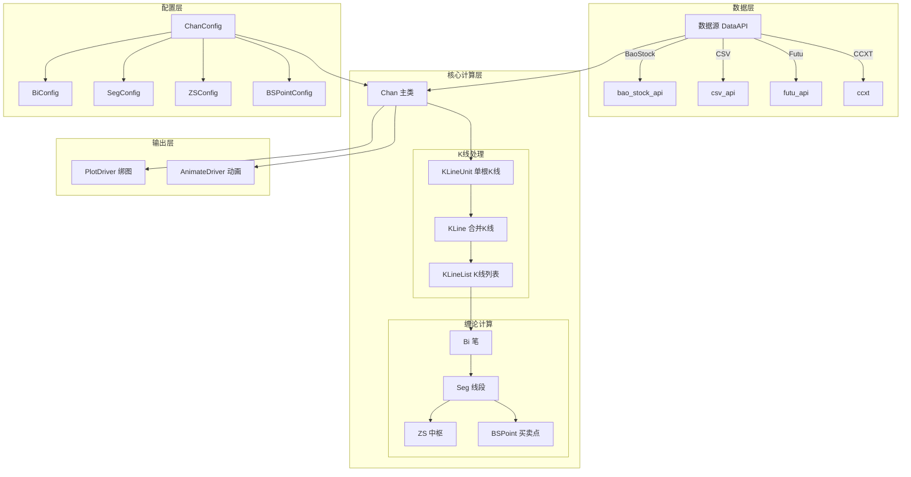

# 整体架构

## 架构图 (Mermaid)



---

## 架构图 (纯文本版本)

```
┌─────────────────────────────────────────────────────────────────┐
│                          数据层                                  │
├─────────────────────────────────────────────────────────────────┤
│  ┌─────────────┐  ┌─────────────┐  ┌─────────────┐             │
│  │  BaoStock   │  │    CSV      │  │    Futu     │  ...        │
│  │  (A股数据)  │  │  (本地文件) │  │  (港美股)   │             │
│  └──────┬──────┘  └──────┬──────┘  └──────┬──────┘             │
│         │                │                │                     │
│         └────────────────┼────────────────┘                     │
│                          ▼                                      │
│                  CommonStockApi (抽象接口)                       │
└─────────────────────────┬───────────────────────────────────────┘
                          │
                          ▼
┌─────────────────────────────────────────────────────────────────┐
│                       核心计算层                                 │
├─────────────────────────────────────────────────────────────────┤
│                                                                 │
│   ┌─────────────────────────────────────────────────────────┐   │
│   │                    Chan (主入口类)                       │   │
│   │  - 协调各模块                                           │   │
│   │  - 管理多级别数据                                       │   │
│   │  - 控制计算流程                                         │   │
│   └─────────────────────────┬───────────────────────────────┘   │
│                             │                                   │
│   ┌─────────────────────────▼───────────────────────────────┐   │
│   │                   KLineList                              │   │
│   │  ┌────────────────────────────────────────────────────┐ │   │
│   │  │ KLineUnit → KLine (合并) → 分形识别                 │ │   │
│   │  └────────────────────────────────────────────────────┘ │   │
│   │  ┌────────────────────────────────────────────────────┐ │   │
│   │  │ BiList: 笔的计算与管理                              │ │   │
│   │  └────────────────────────────────────────────────────┘ │   │
│   │  ┌────────────────────────────────────────────────────┐ │   │
│   │  │ SegList: 线段的计算与管理                           │ │   │
│   │  │   └── ZSList: 中枢的计算与管理                     │ │   │
│   │  └────────────────────────────────────────────────────┘ │   │
│   │  ┌────────────────────────────────────────────────────┐ │   │
│   │  │ BSPointList: 买卖点的计算                           │ │   │
│   │  └────────────────────────────────────────────────────┘ │   │
│   └─────────────────────────────────────────────────────────┘   │
│                                                                 │
└─────────────────────────┬───────────────────────────────────────┘
                          │
                          ▼
┌─────────────────────────────────────────────────────────────────┐
│                         输出层                                   │
├─────────────────────────────────────────────────────────────────┤
│   ┌───────────────────┐        ┌───────────────────┐           │
│   │    PlotDriver     │        │   AnimateDriver   │           │
│   │    (静态图)       │        │    (动画回放)     │           │
│   └───────────────────┘        └───────────────────┘           │
└─────────────────────────────────────────────────────────────────┘
```

---

## 模块职责

| 层级 | 模块 | 职责 |
|------|------|------|
| **数据层** | data_api | 从各种数据源获取K线数据 |
| **核心层** | chan.py | 主入口，协调各模块 |
| | kline | K线存储、合并、分形识别 |
| | bi | 笔的计算与管理 |
| | seg | 线段的计算与管理 |
| | zs | 中枢的计算与管理 |
| | buy_sell_point | 买卖点的计算 |
| | combiner | K线合并器 |
| **配置层** | chan_config | 全局配置管理 |
| **工具层** | common | 枚举、异常、工具函数 |
| | math_util | MACD、均线等技术指标 |
| **输出层** | plot | 绘图与动画 |

---

## 核心计算流程

```
原始K线数据
    │
    ▼
┌─────────────────────────────────────┐
│ 1. K线合并 (KLineCombiner)          │
│    - 处理包含关系                   │
│    - 确定方向                       │
└─────────────────────────────────────┘
    │
    ▼
┌─────────────────────────────────────┐
│ 2. 分形识别                         │
│    - 识别顶分形                     │
│    - 识别底分形                     │
└─────────────────────────────────────┘
    │
    ▼
┌─────────────────────────────────────┐
│ 3. 笔的计算 (BiList)                │
│    - 连接顶底分形                   │
│    - 验证成笔条件                   │
└─────────────────────────────────────┘
    │
    ▼
┌─────────────────────────────────────┐
│ 4. 线段计算 (SegList)               │
│    - 基于笔计算线段                 │
│    - 特征序列分析                   │
└─────────────────────────────────────┘
    │
    ▼
┌─────────────────────────────────────┐
│ 5. 中枢识别 (ZSList)                │
│    - 识别笔的重叠区间               │
│    - 中枢合并                       │
└─────────────────────────────────────┘
    │
    ▼
┌─────────────────────────────────────┐
│ 6. 买卖点计算 (BSPointList)         │
│    - 识别1/2/3类买卖点              │
│    - 背驰判断                       │
└─────────────────────────────────────┘
    │
    ▼
计算结果
```

---

## 设计原则

### 1. 单一职责
每个模块只负责一个功能领域：
- `bi/` 只处理笔相关
- `seg/` 只处理线段相关
- `zs/` 只处理中枢相关

### 2. 依赖倒置
高层模块不依赖低层模块的具体实现：
- 数据源通过 `CommonStockApi` 抽象
- 线段算法通过 `SegListComm` 抽象

### 3. 配置驱动
行为通过配置控制，而非硬编码：
- 笔的算法可配置
- 线段的算法可配置
- 买卖点的条件可配置

### 4. 缓存优化
使用 `@make_cache` 装饰器缓存计算结果：
- 避免重复计算
- 提高批量处理性能

---

## 下一步

- [模块依赖](./02-module-dependencies.md) - 了解模块间关系
- [数据流程](./03-data-flow.md) - 详细数据流程

