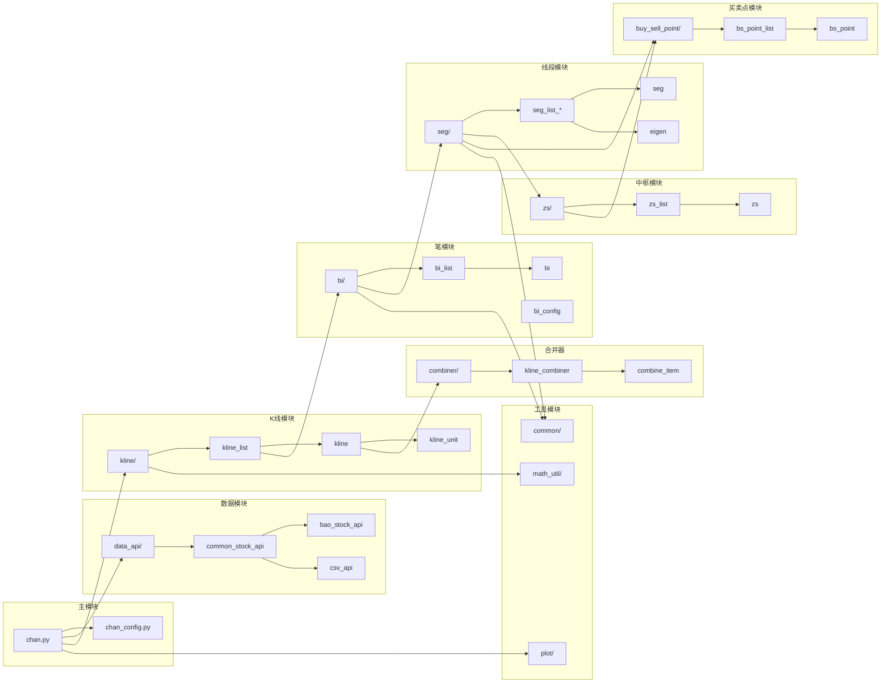

# 模块依赖

## 依赖关系图 (Mermaid)



---

## 依赖关系图 (纯文本版本)

```
                              ┌─────────────────┐
                              │    chan.py      │
                              │   (主入口)      │
                              └────────┬────────┘
                                       │
           ┌───────────────────────────┼───────────────────────────┐
           │                           │                           │
           ▼                           ▼                           ▼
   ┌───────────────┐          ┌───────────────┐          ┌───────────────┐
   │  chan_config  │          │   data_api/   │          │    kline/     │
   │   (配置)      │          │  (数据接口)   │          │  (K线模块)    │
   └───────────────┘          └───────┬───────┘          └───────┬───────┘
                                      │                          │
                              ┌───────┴───────┐                  │
                              ▼               ▼                  │
                      ┌─────────────┐ ┌─────────────┐            │
                      │ bao_stock   │ │   csv_api   │            │
                      └─────────────┘ └─────────────┘            │
                                                                 │
                              ┌───────────────────────────────────┘
                              │
                              ▼
                      ┌───────────────┐
                      │  kline_list   │ ◄──────┐
                      └───────┬───────┘        │
                              │                │
              ┌───────────────┼───────────────┐│
              │               │               ││
              ▼               ▼               ▼│
      ┌─────────────┐ ┌─────────────┐ ┌─────────────┐
      │   kline     │ │  combiner/  │ │    bi/      │
      │ (合并K线)   │ │ (合并器)    │ │   (笔)      │
      └─────────────┘ └─────────────┘ └──────┬──────┘
                                             │
                                             ▼
                                     ┌─────────────┐
                                     │    seg/     │
                                     │  (线段)     │
                                     └──────┬──────┘
                                            │
                              ┌─────────────┼─────────────┐
                              │             │             │
                              ▼             ▼             ▼
                      ┌─────────────┐ ┌─────────────┐ ┌─────────────┐
                      │   zs/       │ │   eigen     │ │buy_sell_point│
                      │  (中枢)     │ │ (特征序列)  │ │  (买卖点)   │
                      └─────────────┘ └─────────────┘ └─────────────┘
                              │                               │
                              └───────────────────────────────┘
                                              │
                                              ▼
                                     ┌─────────────────┐
                                     │     plot/       │
                                     │    (绘图)       │
                                     └─────────────────┘
```

---

## 各模块依赖详情

### chan.py (主模块)

```python
# 直接依赖
from buy_sell_point.bs_point import BSPoint
from chan_config import ChanConfig
from common.enums import AUTYPE, DATA_SRC, KL_TYPE
from common.chan_exception import ChanException, ErrCode
from common.ctime import CTime
from common.func_util import check_kltype_order, kltype_lte_day
from data_api.common_stock_api import CommonStockApi
from kline.kline_list import KLineList
from kline.kline_unit import KLineUnit
```

### kline/ (K线模块)

```
kline/
├── kline_list.py    # 依赖: kline, bi, seg, zs, buy_sell_point
├── kline.py         # 依赖: kline_unit, combiner
├── kline_unit.py    # 依赖: common, math_util
└── trade_info.py    # 无外部依赖
```

### bi/ (笔模块)

```
bi/
├── bi_list.py       # 依赖: bi, bi_config, kline
├── bi.py            # 依赖: kline, common
└── bi_config.py     # 依赖: common
```

### seg/ (线段模块)

```
seg/
├── seg_list_comm.py # 依赖: seg, bi, eigen
├── seg_list_chan.py # 依赖: seg_list_comm, eigen_fx
├── seg.py           # 依赖: bi, zs
├── eigen.py         # 依赖: bi
└── eigen_fx.py      # 依赖: bi, eigen
```

### zs/ (中枢模块)

```
zs/
├── zs_list.py       # 依赖: zs, bi, seg
├── zs.py            # 依赖: bi
└── zs_config.py     # 无外部依赖
```

### buy_sell_point/ (买卖点模块)

```
buy_sell_point/
├── bs_point_list.py  # 依赖: bs_point, bi, seg, zs
├── bs_point.py       # 依赖: bi, zs
└── bs_point_config.py# 依赖: common
```

---

## 循环依赖处理

为避免循环导入，项目中使用了以下策略：

### 1. 延迟导入

```python
# 在 bi.py 中
class Bi:
    def __init__(self, ...):
        # 延迟导入避免循环依赖
        from seg.seg import Seg
        self.parent_seg: Optional[Seg['Bi']] = None
```

### 2. TYPE_CHECKING

```python
from typing import TYPE_CHECKING

if TYPE_CHECKING:
    from seg.seg import Seg
```

---

## 模块初始化顺序

正确的导入顺序：

```
1. common/enums.py       # 枚举定义
2. common/chan_exception.py  # 异常类
3. common/func_util.py   # 工具函数
4. kline/kline_unit.py   # 单根K线
5. combiner/             # 合并器
6. kline/kline.py        # 合并K线
7. bi/                   # 笔
8. seg/                  # 线段
9. zs/                   # 中枢
10. buy_sell_point/      # 买卖点
11. kline/kline_list.py  # K线列表
12. chan.py              # 主入口
```

---

## 下一步

- [数据流程](./03-data-flow.md) - 详细数据流程
- [模块详解](../04-modules/) - 深入各模块

