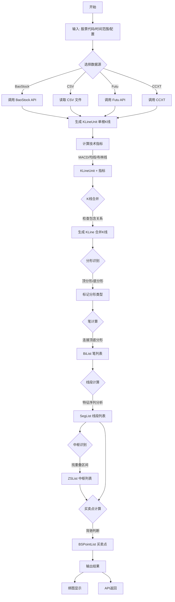

# 数据流程

## 完整数据流程图 (Mermaid)



---

## 数据流程图 (纯文本版本)

```
┌────────────────────────────────────────────────────────────────────────────┐
│                              输入阶段                                       │
├────────────────────────────────────────────────────────────────────────────┤
│                                                                            │
│  用户输入                                                                   │
│  ├── 股票代码 (code): "sz.000001"                                          │
│  ├── 时间范围: begin_time, end_time                                        │
│  ├── 数据源 (data_src): BAO_STOCK / CSV / FUTU / CCXT                     │
│  ├── K线级别 (lv_list): [K_DAY, K_60M, ...]                               │
│  └── 配置 (config): ChanConfig                                             │
│                                                                            │
└──────────────────────────────────┬─────────────────────────────────────────┘
                                   │
                                   ▼
┌────────────────────────────────────────────────────────────────────────────┐
│                             数据获取阶段                                    │
├────────────────────────────────────────────────────────────────────────────┤
│                                                                            │
│  CommonStockApi.get_kl_data()                                              │
│  │                                                                         │
│  └──► 返回 KLineUnit 生成器                                                │
│       │                                                                    │
│       │  每个 KLineUnit 包含:                                              │
│       │  ├── time: 时间                                                    │
│       │  ├── open/high/low/close: OHLC                                    │
│       │  ├── volume: 成交量                                                │
│       │  └── turnover: 成交额                                              │
│       │                                                                    │
│       ▼                                                                    │
│  计算技术指标                                                               │
│  ├── MACD (fast=12, slow=26, signal=9)                                    │
│  ├── 均线 (mean_metrics)                                                   │
│  ├── 布林线 (boll_n)                                                       │
│  └── 其他 (RSI, KDJ, Demark...)                                           │
│                                                                            │
└──────────────────────────────────┬─────────────────────────────────────────┘
                                   │
                                   ▼
┌────────────────────────────────────────────────────────────────────────────┐
│                             K线合并阶段                                     │
├────────────────────────────────────────────────────────────────────────────┤
│                                                                            │
│  KLineCombiner.add(klu)                                                    │
│  │                                                                         │
│  ├── 检查包含关系                                                          │
│  │   │                                                                     │
│  │   ├── 无包含 → 创建新 KLine                                             │
│  │   │                                                                     │
│  │   └── 有包含 → 合并到当前 KLine                                         │
│  │       ├── 上升趋势: 取高高, 低高                                        │
│  │       └── 下降趋势: 取高低, 低低                                        │
│  │                                                                         │
│  └── 分形识别                                                              │
│      │                                                                     │
│      ├── 检查前中后三根 KLine                                              │
│      │                                                                     │
│      ├── 顶分形: 中间最高                                                  │
│      │   └── 设置 fx = FX_TYPE.TOP                                        │
│      │                                                                     │
│      └── 底分形: 中间最低                                                  │
│          └── 设置 fx = FX_TYPE.BOTTOM                                     │
│                                                                            │
└──────────────────────────────────┬─────────────────────────────────────────┘
                                   │
                                   ▼
┌────────────────────────────────────────────────────────────────────────────┐
│                              笔计算阶段                                     │
├────────────────────────────────────────────────────────────────────────────┤
│                                                                            │
│  BiList.update_bi(klc)                                                     │
│  │                                                                         │
│  ├── 尝试创建第一笔                                                        │
│  │   └── 找到第一对顶底分形                                                │
│  │                                                                         │
│  ├── 检查成笔条件                                                          │
│  │   ├── 跨越K线数 >= 4 (严格笔)                                          │
│  │   ├── 顶底分形价格关系正确                                              │
│  │   └── 分形有效性验证                                                    │
│  │                                                                         │
│  ├── 更新笔端点                                                            │
│  │   └── 同向分形时，取更极端的点                                          │
│  │                                                                         │
│  └── 处理虚笔                                                              │
│      └── 未确定的最后一笔                                                  │
│                                                                            │
│  输出: BiList                                                              │
│  ├── bi[0], bi[1], bi[2], ...                                             │
│  └── 每个 Bi: begin_klc, end_klc, dir, is_sure                           │
│                                                                            │
└──────────────────────────────────┬─────────────────────────────────────────┘
                                   │
                                   ▼
┌────────────────────────────────────────────────────────────────────────────┐
│                             线段计算阶段                                    │
├────────────────────────────────────────────────────────────────────────────┤
│                                                                            │
│  SegListChan.update(bi_list)  [默认算法]                                   │
│  │                                                                         │
│  ├── 构建特征序列                                                          │
│  │   └── 将同向笔组成 Eigen                                                │
│  │                                                                         │
│  ├── 特征序列分形 (EigenFX)                                                │
│  │   ├── 找特征序列的顶底分形                                              │
│  │   └── 确定线段端点                                                      │
│  │                                                                         │
│  ├── 线段终结判断                                                          │
│  │   ├── 特征序列分形确认                                                  │
│  │   └── 1+1终结 (可选算法)                                               │
│  │                                                                         │
│  └── 处理剩余笔                                                            │
│      └── left_seg_method: all / peak                                      │
│                                                                            │
│  输出: SegList                                                             │
│  ├── seg[0], seg[1], seg[2], ...                                          │
│  └── 每个 Seg: start_bi, end_bi, dir, is_sure                            │
│                                                                            │
└──────────────────────────────────┬─────────────────────────────────────────┘
                                   │
                                   ▼
┌────────────────────────────────────────────────────────────────────────────┐
│                             中枢计算阶段                                    │
├────────────────────────────────────────────────────────────────────────────┤
│                                                                            │
│  ZSList.add_bi_in_zs(bi)                                                   │
│  │                                                                         │
│  ├── 计算笔的重叠区间                                                      │
│  │   └── 连续3笔有重叠 → 形成中枢                                         │
│  │                                                                         │
│  ├── 中枢延伸                                                              │
│  │   └── 新笔与中枢有重叠 → 加入中枢                                      │
│  │                                                                         │
│  ├── 中枢合并 (zs_combine=True)                                           │
│  │   └── 相邻中枢有重叠 → 合并                                            │
│  │                                                                         │
│  └── 确定中枢属性                                                          │
│      ├── high/low: 重叠区间                                               │
│      ├── peak_high/peak_low: 极值                                         │
│      └── bi_in/bi_out: 进出笔                                             │
│                                                                            │
│  输出: 每个 Seg 关联 ZSList                                                │
│                                                                            │
└──────────────────────────────────┬─────────────────────────────────────────┘
                                   │
                                   ▼
┌────────────────────────────────────────────────────────────────────────────┐
│                            买卖点计算阶段                                   │
├────────────────────────────────────────────────────────────────────────────┤
│                                                                            │
│  BSPointList.cal(bi_list, seg_list)                                        │
│  │                                                                         │
│  ├── 一类买卖点 (T1)                                                       │
│  │   ├── 趋势末端                                                          │
│  │   ├── 至少经历 min_zs_cnt 个中枢                                       │
│  │   └── 背驰判断 (divergence_rate)                                       │
│  │                                                                         │
│  ├── 盘整背驰 (T1P)                                                        │
│  │   └── 盘整走势中的背驰                                                  │
│  │                                                                         │
│  ├── 二类买卖点 (T2)                                                       │
│  │   ├── 一类后的第一次回调                                                │
│  │   └── 不破一类买卖点 (max_bs2_rate)                                    │
│  │                                                                         │
│  ├── 类二买卖点 (T2S)                                                      │
│  │   └── 二类后的类似结构                                                  │
│  │                                                                         │
│  └── 三类买卖点 (T3A/T3B)                                                  │
│      └── 离开中枢后回调不进入                                              │
│                                                                            │
│  输出: BSPointList                                                         │
│  ├── 每个 BSPoint: bi, is_buy, type                                       │
│  └── 关联到对应的 Bi                                                       │
│                                                                            │
└──────────────────────────────────┬─────────────────────────────────────────┘
                                   │
                                   ▼
┌────────────────────────────────────────────────────────────────────────────┐
│                              输出阶段                                       │
├────────────────────────────────────────────────────────────────────────────┤
│                                                                            │
│  结果存储在 Chan 对象中:                                                   │
│  │                                                                         │
│  ├── chan[lv].lst           → 合并K线列表                                  │
│  ├── chan[lv].bi_list       → 笔列表                                       │
│  ├── chan[lv].seg_list      → 线段列表                                     │
│  └── chan[lv].bs_point_lst  → 买卖点列表                                   │
│                                                                            │
│  可选输出:                                                                  │
│  ├── PlotDriver.bindbindbindBindBindBindBindSave()bindSave bindSave→ 静态图片                                         │
│  ├── AnimateDriver           → 动画回放                                    │
│  └── chan.toJson()          → JSON格式 (完整版)                           │
│                                                                            │
└────────────────────────────────────────────────────────────────────────────┘
```

---

## 多级别数据流

```
┌─────────────────────────────────────────────────────────────────┐
│                        多级别联立计算                            │
├─────────────────────────────────────────────────────────────────┤
│                                                                 │
│  lv_list = [K_DAY, K_60M]                                      │
│                                                                 │
│  日线 (父级别)                                                  │
│  ┌────┬────┬────┬────┬────┬────┐                              │
│  │ D1 │ D2 │ D3 │ D4 │ D5 │ D6 │                              │
│  └──┬─┴──┬─┴──┬─┴──┬─┴──┬─┴──┬─┘                              │
│     │    │    │    │    │    │                                 │
│     ▼    ▼    ▼    ▼    ▼    ▼                                 │
│  60分钟 (子级别)                                                │
│  ┌──┬──┬──┬──┬──┬──┬──┬──┬──┬──┬──┬──┬──┬──┬──┐              │
│  │M1│M2│M3│M4│M5│M6│M7│M8│M9│..│..│..│..│..│Mn│              │
│  └──┴──┴──┴──┴──┴──┴──┴──┴──┴──┴──┴──┴──┴──┴──┘              │
│                                                                 │
│  关联关系:                                                      │
│  ├── 日线 D1 包含 60分钟 M1~M4                                 │
│  ├── klu.sup_kl → 父级别K线                                    │
│  └── klu.sub_kl_list → 子级别K线列表                           │
│                                                                 │
└─────────────────────────────────────────────────────────────────┘
```

---

## 下一步

- [模块详解](../04-modules/) - 深入各模块实现
- [配置指南](../05-configuration/) - 配置参数详解

